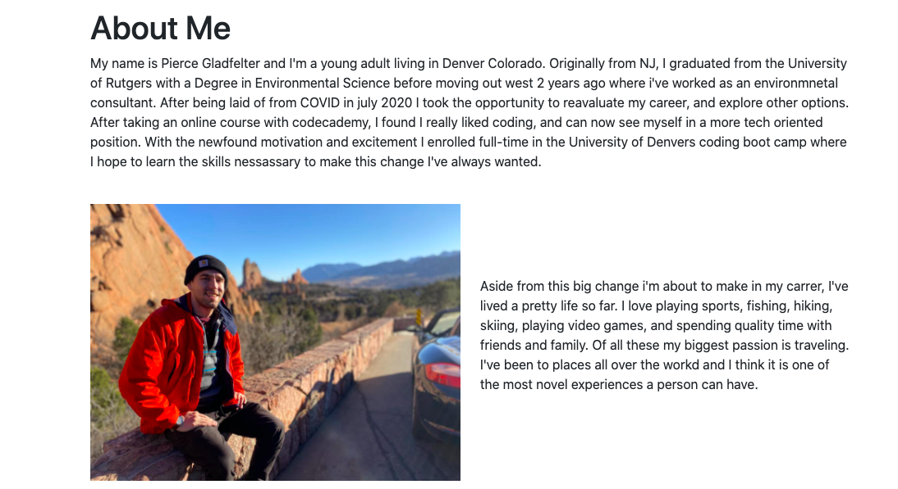
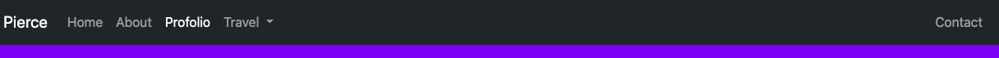
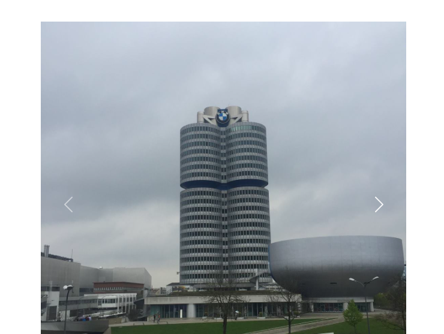
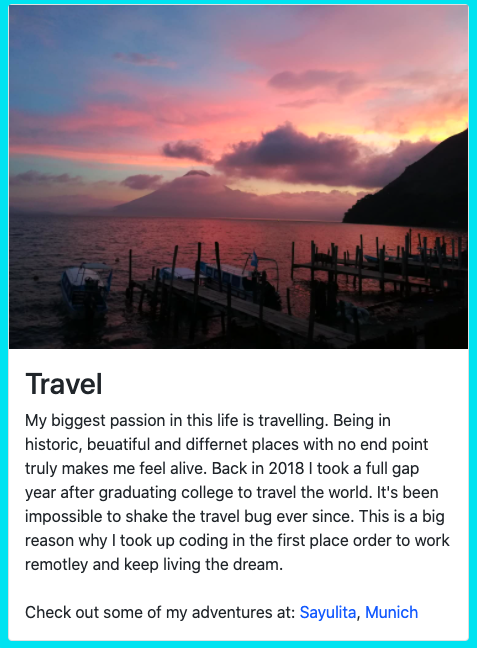

# PierceQuest

Descrtiption

This repository contains a website consiting of personalized information and a profolio to showcase my proffessional accomplishments and interests. The main feature I utilized in its ceation was responsivness in conjection with Bootsrap.

Motivation

Currently I am enrolled in the the University of Denver's coding bootcamp pursing a new career in the tech world. If I want to land a quality developer job it is vital that I showcase my work and who I am. A personalized website is great way to accomplish this as well as practicing my skills in HTML, CSS, and Boot strap

Development

To begin I started by sketching out a basic design of how I wanted each of my sub web pages to my site to look as well as their functionality. Next I created my intitial skeletal HTML files linked to bootstrap, and an asset folder with a universal CSS file and images. Following this intialization, I developed each HTML file primarly utilizing Bootsraps grid system with some CSS of my own to convey text, images, and components in an athetic, intuaitive and organized manner. After completing the first addition of each of my sub webdpages, I then spent the vast majority of the time adjusting, adding, and expirimenting with additional Bootsrap features until I was satified with the final product to present the user.

Feaures/Usage

To run the website simply clink on the provided link below.

https://pwg26.github.io/PierceQuest/

This website utilizes a variaty of Bootstrap features including:

    - Containers, rows, and coloumns to organize and globalize properties to my content.

     

    - A Nav Bar with links to direct the useer to different pages.

    

    - Other Bootstrap components such as cards, caurosels, and contact fourm submissions

    

    - Responsiveness in the layout, images, and components so the content can adjust to a variety of viewports.

    

Foreward

This is an ongoing project and in time will include many more additions in the form of additonal project links as my profolio grows, and additional destinations I have featured in my traval section.
